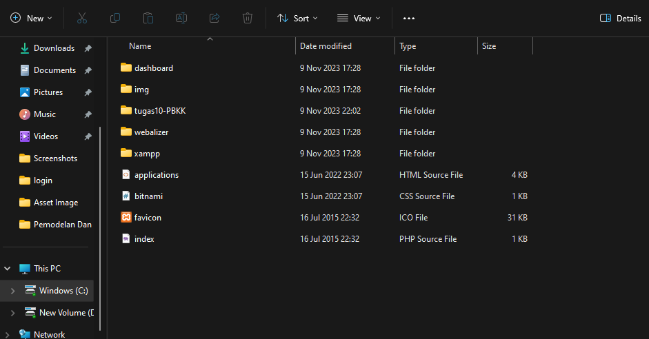
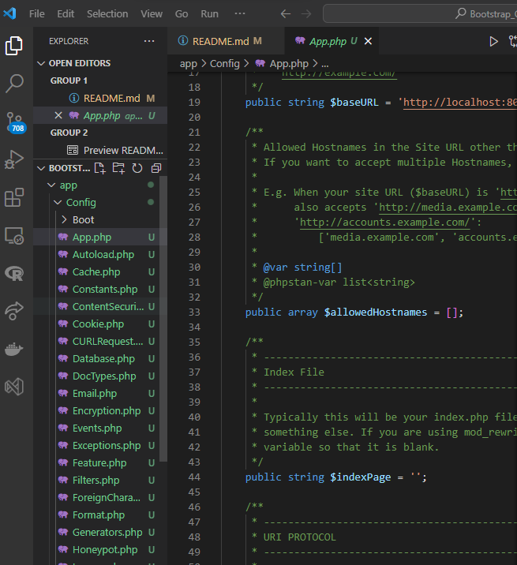
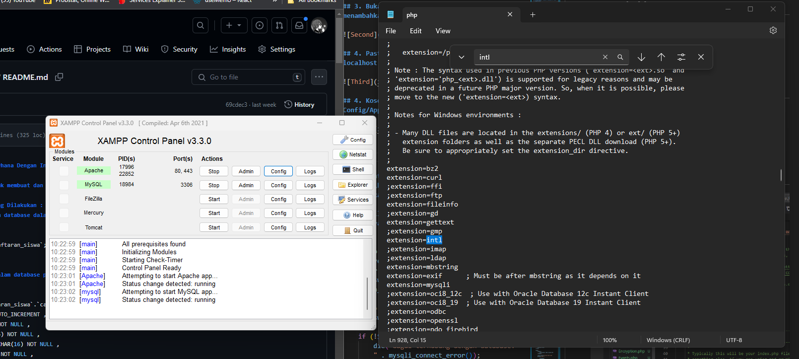

# Bootstrap using CodeIgniter 4 Framework

## Ini adalah tugas untuk membuat dan mengimplementasikan website dashboard dengan menggunakan framework bootstrap di dalam codeigniter4. Didalamnya terdapat suatu gambar perkembangan grafik yang termuat dengan phpMyAdmin dengan http://localhost/home/dashboard

## Langkah - Langkah Yang Dilakukan :
## 1. Buat sebuah framework codeigniter4 dalam C:\xampp\htdocs




## 2. Buka lalu lakukan setting env dengan menambahkan . 


## 3. Buka lalu lakukan setting env dengan menambahkan . 


## 4. Pastikan bahwa alamat url sesuai dengan localhost


## 4. Kosongkan indexpage pada direktori app/Config/App.php



## 5. Buka xampp dan lakukan setting pada Apache di config dengan memilih opsi file (php.ini). Cari dan hilangkan ; pada intl agar program dapat berjalan



## 5. Buka direktori folder di vscode dan running program dengan terminal dengan kode 

    ```R
        php spark serve
    ``` 


## 6. Click link localhost pada terminal seperti ini


## 7. Akan muncul hasil seperti gambar dibawah


## 8. Lalukan penambahan setting pada Config/Routes.php


## 9. Saya akan memakai template dashboard bootstrap menggunakan link ini 

    https://drive.google.com/file/d/1wDtL67V6plUSoYkDH8k5rBQseC_DLo-F/view

## Lalu buat folder baru dalam public dengan nama assets dan pindahkan folder css, font, js, tables


## 10. Lalu buat direktori didalam app\Views dengan nama backend lalu buat direktori Login dan masukkan file dari bootstrap dengan tipe php


## 11. Lalu setting Home.php dalam Controllers/Home.php dengan gambar seperti dibawah ini 


## 12. Lalu masing-masing login.php dan daashboard.php dengan menambahkan /assets pada href baik atas maupun bawah


## Hasil dari program akan seperti berikut 

### 1. Hasil Program pada login (http://localhost:8080/home/index)


### 2. Hasil Program pada dashboard (http://localhost:8080/home/dashboard)
